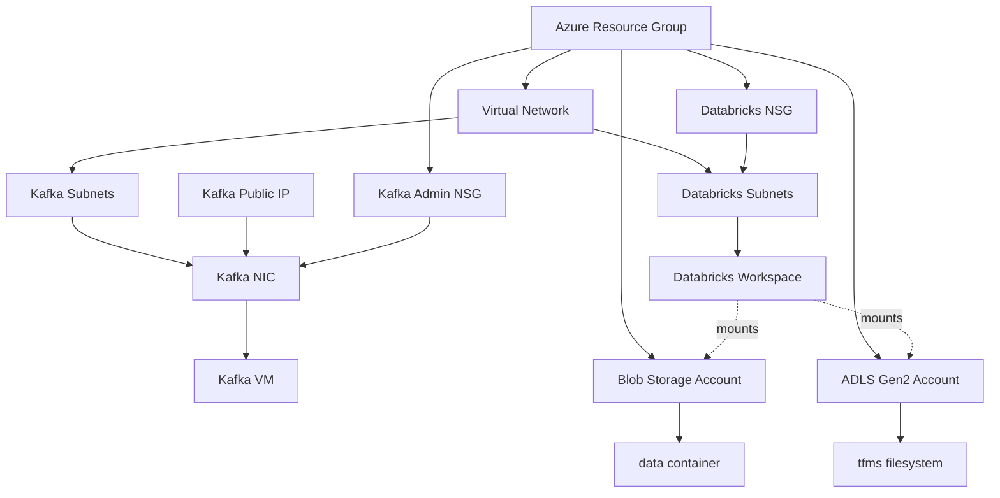

# Single Kafka Node on Azure

Terraform that provisions a single-node Apache Kafka VM on Azure along with the networking, storage, and Azure Databricks workspace needed to ingest messages from a Solace PubSub+ broker and land data for analytics.

> **Scope:** this is a **development** topology (single Kafka broker, single zookeeper, dev Databricks tier). It is intentionally lean — do not use it as-is for production.

---

## Table of contents

1. [What this repo provisions](#what-this-repo-provisions)
2. [Architecture](#architecture)
3. [What Terraform does vs. what you do manually](#what-terraform-does-vs-what-you-do-manually)
4. [Prerequisites](#prerequisites)
5. [Tool and runtime versions](#tool-and-runtime-versions)
6. [Configuration](#configuration)
7. [Provision the infrastructure](#provision-the-infrastructure)
8. [Post-deploy operator checklist](#post-deploy-operator-checklist)
9. [Install and configure Kafka on the VM](#install-and-configure-kafka-on-the-vm)
10. [Bootstrap alternatives](#bootstrap-alternatives)
11. [Install the Solace PubSub+ Kafka connector](#install-the-solace-pubsub-kafka-connector)
12. [Manage Kafka topics](#manage-kafka-topics)
13. [Configure the Solace source connector](#configure-the-solace-source-connector)
14. [Consume messages](#consume-messages)
15. [Tear down](#tear-down)
16. [Repository layout](#repository-layout)
17. [Improvement roadmap](#improvement-roadmap)
18. [GitHub Actions automation](#github-actions-automation)

---

## What this repo provisions

Azure resources created by `terraform apply`:

- A new **resource group**
- A **virtual network** with:
  - Four subnets reserved for the Kafka VM (sized so you can grow into a cluster later)
  - Two subnets (`publicDB`, `privateDB`) dedicated to Databricks VNet injection
- A **Kafka-admin NSG** allowing SSH and HTTP **only from the IPs you whitelist**, attached to the Kafka NIC
- A **Databricks NSG** associated with the Databricks subnets
- A **public IP** + **NIC** + **RHEL VM** that will host Kafka/Zookeeper
- A **Blob Storage Account** with a `data` container (mounted in Databricks)
- An **ADLS Gen2 Storage Account** with a `tfms` filesystem
- An **Azure Databricks workspace** (trial SKU) with VNet injection

See [Repository layout](#repository-layout) for which file owns which resources.

---

## Architecture



---

## What Terraform does vs. what you do manually

| Concern | Handled by Terraform | Manual on the VM |
| --- | --- | --- |
| Azure resource group, VNet, subnets, NSGs | ✅ | |
| Kafka VM (RHEL), public IP, NIC, NSG attachment | ✅ | |
| Storage accounts, container, ADLS filesystem | ✅ | |
| Databricks workspace with VNet injection | ✅ | |
| Baseline packages on the VM (`httpd`, `java-11-openjdk-devel`, `tmux`, `git`) | ✅ (via `custom_data` cloud-init) | |
| Download and install Apache Kafka | ✅ (via `cloud-init/kafka-bootstrap.yaml.tftpl`) | |
| `systemd` units for Zookeeper and Kafka | ✅ (cloud-init) | |
| Firewall rule for port 9092 | ✅ (cloud-init) | |
| Installing and configuring the Solace connector | | ✅ |
| Creating Kafka topics | | ✅ |

> Want to learn what the automation does step by step, or reproduce it on a different host? See [`docs/manual-kafka-setup.md`](docs/manual-kafka-setup.md).

---

## Prerequisites

- Azure CLI logged in to the target subscription (`az login`) for local runs. GitHub Actions uses an Azure service principal with a client secret stored in GitHub Secrets.
- An HCP Terraform workspace in **Local** execution mode for shared state. Follow [GitHub Actions setup](docs/github-actions.md) for authentication and migration of existing local state before the next deployment.
- Terraform CLI and Azure provider versions listed in [Tool and runtime versions](#tool-and-runtime-versions).
- An SSH key pair. To create one:

  ```bash
  ssh-keygen -t rsa -b 4096 -m PEM -C "vm@mydomain.com" -f ~/.ssh/vm_ssh
  ```

  The path is passed to Terraform via `sshKeyPath` and is expanded with `pathexpand(...)`, so `~/.ssh/...` works.

More on the Azure provider: <https://docs.microsoft.com/en-us/azure/virtual-machines/linux/terraform-install-configure>.

---

## Tool and runtime versions

This repo currently pins the infrastructure tooling but keeps the Kafka runtime intentionally old to preserve the original tutorial and Solace connector behavior.

| Component | Version | Where configured | Notes |
| --- | --- | --- | --- |
| Terraform CLI | `>= 1.16.2` | `main.tf` | GitHub Actions uses Terraform `1.16.2`. |
| AzureRM provider | `= 4.81.0` | `main.tf` | Pinned via `required_providers`. |
| Azure CLI | `2.87.0` | Local prerequisite | Used for Azure auth (`az login`). Newer versions should work. |
| VM image | Red Hat Enterprise Linux `9_7` | `variables.tf` (`vmImage*`) | Pulled as `latest` from the Azure marketplace. RHEL 9_7 ships `java-11-openjdk-devel`; RHEL 10 drops OpenJDK 11, and `7-RAW-CI` is deprecated/unavailable in some regions. |
| Apache Kafka | `2.3.0` | `variables.tf` (`kafkaVersion`) | Requires ZooKeeper. KRaft mode is not available in this version. |
| Kafka Scala build | `2.12` | `variables.tf` (`kafkaScalaVersion`) | Matches the `kafka_2.12-2.3.0.tgz` artifact. |
| Java | `java-11-openjdk-devel` | `variables.tf` (`javaPackage`) | Required by Solace connector 3.3.0 (`class file version 55`). Kafka 2.3.0 also runs on Java 11. |
| Solace PubSub+ Kafka source connector | `3.3.0` | README install command | Installed manually after VM bootstrap. |

> **Kafka note:** newer Kafka releases can run without ZooKeeper using KRaft mode. This repo still uses Kafka `2.3.0`, so ZooKeeper is required. A future Kafka modernization pass could upgrade Kafka and remove `zookeeper.service`.

---

## Configuration

All tunable inputs live in `variables.tf`. A starter file is provided — copy it and edit the values you care about:

```bash
cp terraform.tfvars.example terraform.tfvars
$EDITOR terraform.tfvars
```

**Variables you almost always want to override:**

| Variable | Why |
| --- | --- |
| `sourceIPs` | List of CIDRs or IPs allowed to reach SSH/HTTP on the Kafka VM. **Default is the repo author's home IP for dev convenience — change it.** |
| `sshKeyPath` | Path to your public key; supports `~`. |
| `storageAccountName` | Must be globally unique, 3–24 lowercase alphanumeric characters. |
| `location` | Azure region. |
| `suffix`, `rgName`, `workspaceName` | Give the deployment recognizable names. |
| `javaPackage` | Keep as `java-11-openjdk-devel` for Solace connector 3.3.0 unless you also change connector/runtime versions. |

> **Tip:** the storage account name is used as a prefix for the ADLS account (`<name>adsl`), so keep it short enough to fit under 24 characters.

---

## Provision the infrastructure

From the repo root:

```bash
terraform login
unset TF_CLOUD_ORGANIZATION TF_WORKSPACE TF_CLOUD_PROJECT
terraform fmt
terraform init
terraform validate
terraform plan -out tfplan
terraform apply tfplan
```

State is stored in HCP Terraform through the cloud block in [main.tf](main.tf), targeting organization **`chambras`**, project **`SWIM`**, and workspace **`SingleKafKaNode`**. The configuration supplies these values; clear old exports to avoid conflicting workspace selections. Ensure the workspace uses **Local** execution mode before initializing. If you already have local state, follow the [state migration instructions](docs/github-actions.md#5-migrate-existing-local-state-before-enabling-actions) before running a plan or enabling automation.

Useful outputs after `apply`:

- `kafkaPublicIP` — the VM's public IP (SSH target).
- `storageAccountKey` — **sensitive**, use `terraform output -raw storageAccountKey`.
- `databricksWorkspaceURL` — click-through to the workspace.

---

## GitHub Actions automation

The [Terraform workflow](.github/workflows/terraform.yml) applies on pushes or merges to `main`, and offers manual `apply` and `destroy` operations. Destroy requires typing the HCP workspace name. Both operations use the same remote state and concurrency group.

Authentication uses **Azure service-principal credentials** (`ARM_CLIENT_ID`, `ARM_CLIENT_SECRET`, `ARM_TENANT_ID`, `ARM_SUBSCRIPTION_ID`) and an **HCP Terraform API token** (`TF_API_TOKEN`), all supplied through GitHub Secrets. No OIDC setup is required. Deployment inputs use the defaults in [variables.tf](variables.tf), with the SSH public key supplied through GitHub Secret `VM_SSH_PUBLIC_KEY`. Preserve any existing deployment overrides before switching to defaults. For this initial development test, both storage accounts allow authenticated access from all networks so `ubuntu-latest` runners can reach them; anonymous blob access remains disabled. Restore network restrictions or destroy the stack after the test.

Follow [GitHub Actions setup](docs/github-actions.md) to configure the identity, environment, runner, inputs, and state migration. The workflow remains disabled until the repository variable `TERRAFORM_AUTOMATION_ENABLED` is `true`.

---

## Post-deploy operator checklist

Run through this list before handing the environment to anyone:

- [ ] `sourceIPs` contains **only** the IPs that should have SSH/HTTP access.
- [ ] You can `ssh kafkaAdmin@<kafkaPublicIP> -i <path-to-private-key>`.
- [ ] Storage account key is **not** pasted into shared channels (`terraform output storageAccountKey` is marked sensitive).
- [ ] Databricks workspace opens and can mount the `data` container and `tfms` filesystem using authorized credentials.
- [ ] After the initial test, restore storage network restrictions from an authorized network path or destroy the stack. The all-network test setting does not expire automatically.
- [ ] Tag/label the resource group with an owner and expiration if your subscription enforces it.
- [ ] Destroy the environment when you are done (see [Tear down](#tear-down)).

---

## Install and configure Kafka on the VM

Cloud-init (`cloud-init/kafka-bootstrap.yaml.tftpl`) runs on first boot and:

- Installs `httpd`, `java-11-openjdk-devel`, `tmux`, `git`, `wget`, `tar`, and `firewalld`.
- Downloads Apache Kafka `${kafkaVersion}` (Scala `${kafkaScalaVersion}`) from `archive.apache.org` to `/opt/kafka`.
- Writes systemd units for **Zookeeper** and **Kafka** owned by the `vmUserName` account.
- Enables and starts both services (idempotent — safe to re-run).
- Opens TCP `9092` in `firewalld`.
- Puts Kafka tools on `PATH` for all users via `/etc/profile.d/kafka.sh`.

The Kafka/Scala versions are tunable via the `kafkaVersion` and `kafkaScalaVersion` variables.

### Verify the bootstrap

SSH in and check:

```bash
ssh kafkaAdmin@<kafkaPublicIP> -i ~/.ssh/vm_ssh

systemctl is-active zookeeper
systemctl is-active kafka
ss -ltn | grep -E '(2181|9092)'
kafka-topics.sh --bootstrap-server localhost:9092 --list
```

If cloud-init is still running the first time you SSH in, tail its log:

```bash
sudo tail -f /var/log/cloud-init-output.log
```

> Prefer to learn the setup by hand, or need to reproduce it elsewhere? See [`docs/manual-kafka-setup.md`](docs/manual-kafka-setup.md).

---

## Bootstrap alternatives

Cloud-init is the default supported deployment path, but this repo also includes equivalent examples for learning and troubleshooting:

| Option | Location | Use case |
| --- | --- | --- |
| Cloud-init | `cloud-init/kafka-bootstrap.yaml.tftpl` | Default `terraform apply` path. |
| Standalone script | `scripts/install-kafka.sh` | Manual repair/debug path on an existing VM. |
| Ansible | `ansible/playbook.yml` | Post-provision configuration management example. |

See [`docs/bootstrap-options.md`](docs/bootstrap-options.md) for commands and comparison details.

---

## Install the Solace PubSub+ Kafka connector

```bash
wget https://solaceproducts.github.io/pubsubplus-connector-kafka-source/downloads/pubsubplus-connector-kafka-source-3.3.0.zip
unzip pubsubplus-connector-kafka-source-3.3.0.zip
cp -v pubsubplus-connector-kafka-source-3.3.0/lib/*.jar /opt/kafka/libs/
```

This bundle ships all dependencies — no Maven build required. To build from source instead, see the upstream [README](https://github.com/SolaceProducts/pubsubplus-connector-kafka-source).

---

## Manage Kafka topics

All commands below use `--bootstrap-server` (the supported flag for Kafka 2.2+). `--zookeeper` is deprecated and should not be used.

Because this is a single-broker node, use `--replication-factor 1`.

### Create topics

```bash
kafka-topics.sh --bootstrap-server localhost:9092 --create --replication-factor 1 --partitions 1 --topic stdds
kafka-topics.sh --bootstrap-server localhost:9092 --create --replication-factor 1 --partitions 1 --topic tfms
kafka-topics.sh --bootstrap-server localhost:9092 --create --replication-factor 1 --partitions 1 --topic tbfm
```

### List topics

```bash
kafka-topics.sh --bootstrap-server localhost:9092 --list
```

### Describe a topic

```bash
kafka-topics.sh --bootstrap-server localhost:9092 --describe --topic tfms
```

### Delete a topic

```bash
kafka-topics.sh --bootstrap-server localhost:9092 --delete --topic stdds
kafka-topics.sh --bootstrap-server localhost:9092 --delete --topic tfms
```

---

## Configure the Solace source connector

Edit `/opt/kafka/config/connect-standalone.properties` and set:

```properties
bootstrap.servers=localhost:9092
key.converter=org.apache.kafka.connect.storage.StringConverter
value.converter=org.apache.kafka.connect.storage.StringConverter
key.converter.schemas.enable=true
value.converter.schemas.enable=true
offset.storage.file.filename=/tmp/connect.offsets
offset.flush.interval.ms=10000
```

Create one connector properties file per source topic:

```bash
sudo vi /opt/kafka/config/connect-solace-stdds-source.properties
sudo vi /opt/kafka/config/connect-solace-tfms-source.properties
sudo vi /opt/kafka/config/connect-solace-tbfm-source.properties
```

The mandatory values (replace the `{{ }}` placeholders) are:

| Property | Meaning |
| --- | --- |
| `name` | Unique connector name |
| `kafka.topic` | Target Kafka topic |
| `sol.host` | `host:port` of the Solace broker |
| `sol.username` / `sol.password` | Broker credentials |
| `sol.vpn_name` | Solace VPN name |
| `sol.queue` | Queue the connector consumes from (must exist) |

Minimal connector file:

```properties
name={{ connectorName }}
connector.class=com.solace.connector.kafka.connect.source.SolaceSourceConnector
tasks.max=2
value.converter=org.apache.kafka.connect.converters.ByteArrayConverter
key.converter=org.apache.kafka.connect.storage.StringConverter

kafka.topic={{ kafkaTopic }}

sol.host={{ SWIMEndpoint }}:{{ SWIMEndpointPort }}
sol.username={{ SWIMUserName }}
sol.password={{ Password }}
sol.vpn_name={{ SWIMVPN }}
sol.queue={{ SWIMQueue }}

sol.message_processor_class=com.solace.connector.kafka.connect.source.msgprocessors.SolaceSampleKeyedMessageProcessor
sol.ssl_validate_certificate=false
```

TLS, Kerberos, and JCSMP tuning options can be added as needed — see the [upstream docs](https://github.com/SolaceProducts/pubsubplus-connector-kafka-source) for the full list.

Restart Kafka and start the connector in standalone mode:

```bash
sudo systemctl restart kafka.service

# stdds
connect-standalone.sh /opt/kafka/config/connect-standalone.properties /opt/kafka/config/connect-solace-stdds-source.properties

# tfms
connect-standalone.sh /opt/kafka/config/connect-standalone.properties /opt/kafka/config/connect-solace-tfms-source.properties

# tbfm
connect-standalone.sh /opt/kafka/config/connect-standalone.properties /opt/kafka/config/connect-solace-tbfm-source.properties
```

If you see an error like this:

```text
java.lang.UnsupportedClassVersionError: com/solace/connector/kafka/connect/source/SolaceSourceConnector has been compiled by a more recent version of the Java Runtime (class file version 55.0), this version of the Java Runtime only recognizes class file versions up to 52.0
```

the VM is running Java 8. Solace connector 3.3.0 requires Java 11. New VMs install Java 11 through `javaPackage`; on an existing VM, install it manually and restart Kafka/connect:

```bash
sudo yum install -y java-11-openjdk-devel
java -version
sudo systemctl restart kafka.service
```

---

## Consume messages

Read from the beginning (may be slow on busy topics):

```bash
kafka-console-consumer.sh --bootstrap-server localhost:9092 --topic stdds --from-beginning
kafka-console-consumer.sh --bootstrap-server localhost:9092 --topic tfms  --from-beginning
kafka-console-consumer.sh --bootstrap-server localhost:9092 --topic tbfm  --from-beginning
```

Read just the first message:

```bash
kafka-console-consumer.sh --bootstrap-server localhost:9092 --topic stdds --from-beginning --max-messages 1
kafka-console-consumer.sh --bootstrap-server localhost:9092 --topic tfms  --from-beginning --max-messages 1
kafka-console-consumer.sh --bootstrap-server localhost:9092 --topic tbfm  --from-beginning --max-messages 1
```

Run `kafka-console-consumer.sh` with no arguments to see all options.

---

## Tear down

```bash
terraform destroy
```

> ⚠️ This removes **everything** the stack created, including storage accounts and their data.

---

## Repository layout

```text
.
├── ansible/
│   ├── inventory.example.ini
│   ├── playbook.yml
│   └── roles/kafka/             # optional Ansible bootstrap path
├── cloud-init/
│   └── kafka-bootstrap.yaml.tftpl  # cloud-init template that installs Kafka/Zookeeper
├── docs/
│   ├── bootstrap-options.md      # comparison of bootstrap approaches
│   └── manual-kafka-setup.md       # learning-path equivalent of the automation
├── scripts/
│   └── install-kafka.sh          # standalone shell bootstrap path
├── LICENSE
├── README.md
├── main.tf                   # providers, backend
├── networking.tf             # VNet, subnets
├── security.tf               # NSGs + rules
├── storage.tf                # Blob + ADLS Gen2 + container/filesystem
├── vm.tf                     # public IP, NIC, NSG association, Kafka VM
├── workspace.tf              # Databricks workspace (VNet injection)
├── variables.tf              # input variables
├── outputs.tf                # exported values (storage key is sensitive)
└── terraform.tfvars.example  # starter config — copy to terraform.tfvars
```

---

## Caution

Running this repository provisions billable Azure resources. Be sure to `terraform destroy` when you are done.

---

## Authors

- Marcelo Zambrana
